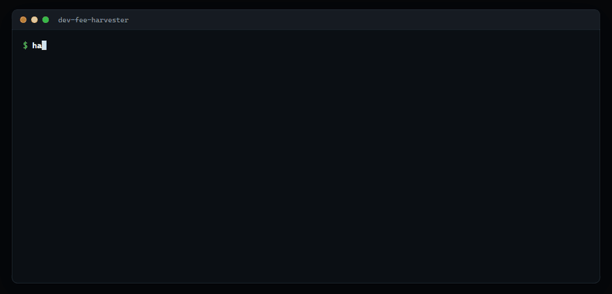
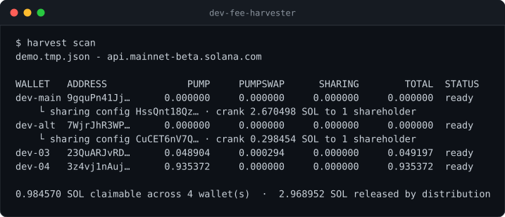
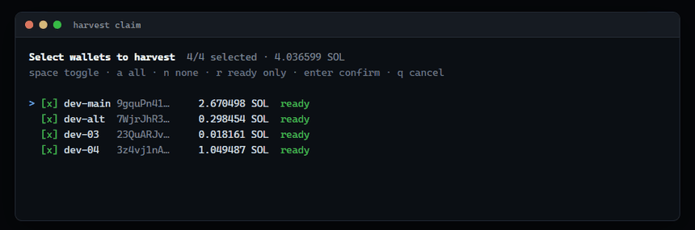
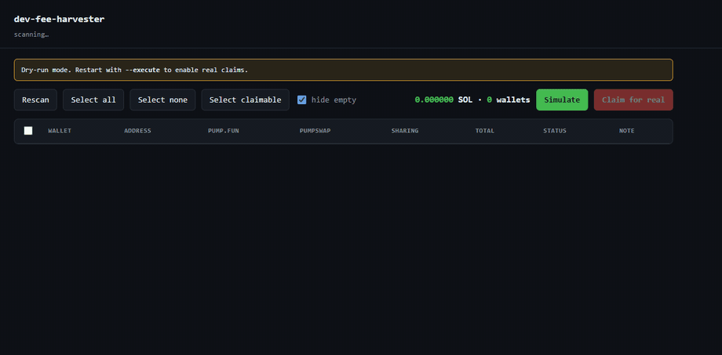
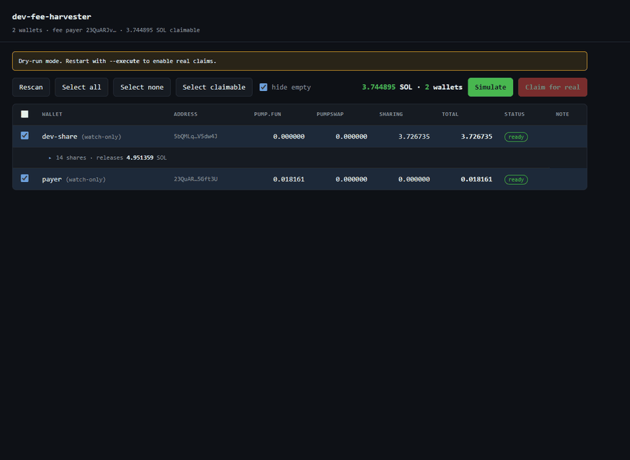
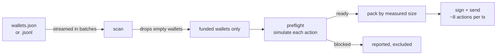
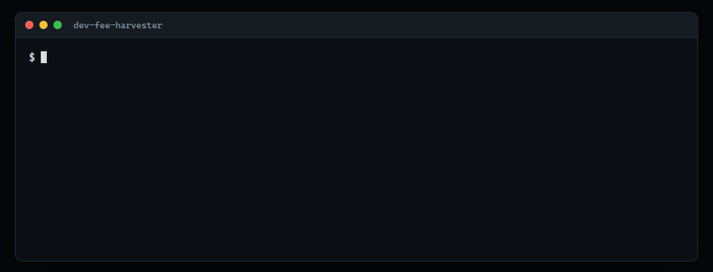
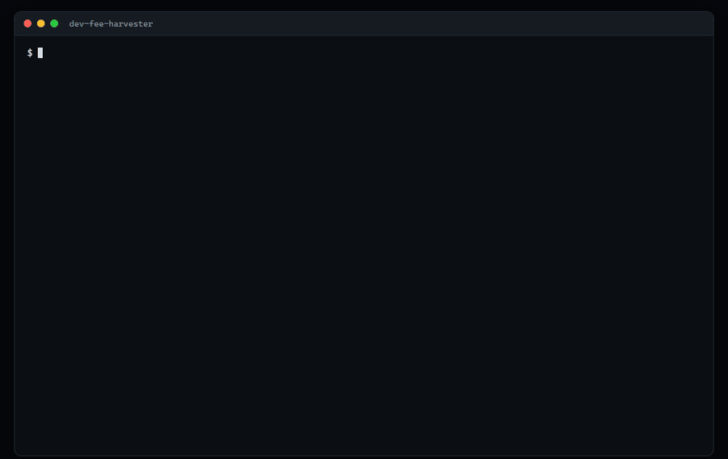

<div align="center">

# dev-fee-harvester

### Claim creator fees across every wallet you own — in one command.

Finds the fees scattered across your dev wallets, tells you exactly what is claimable,<br>
and drains them in batched transactions instead of one transaction per wallet.

[](https://github.com/daronthedragon/dev-fee-harvester/actions/workflows/ci.yml)
[](https://nodejs.org/)
[](#development)
[](#how-this-was-verified)
[](package.json)
[](LICENSE)



<sub><code>harvest claim --all</code> against live mainnet wallets — four wallets packed into one transaction, simulated, nothing sent.</sub>

</div>

---

If you launch coins, your fees end up spread across a lot of wallets. Collecting them means opening each one, connecting it, clicking claim, and repeating — which is why most creators leave months of fees sitting in vaults.

This finds all of it, shows you the total, lets you tick what you want, and claims it in as few transactions as physically fit.

## What it finds

| Source          | Where the fees sit                                     | Claimed with                          |
| --------------- | ------------------------------------------------------ | ------------------------------------- |
| **pump.fun**    | creator vault, as SOL                                  | `collect_creator_fee`                 |
| **PumpSwap**    | vault ATA, as wrapped SOL                              | `collect_coin_creator_fee`            |
| **Fee sharing** | a vault owned by a _config PDA_, split by basis points | `distribute_creator_fees`             |
| **Bags**        | Meteora pools / DAMM v2 / custom fee vaults            | their API builds it, you sign locally |

The third one is the interesting case. Those fees are **invisible to an ordinary per-wallet scan** — see [Fee sharing](#fee-sharing).

## Quick start

```bash
npm install
```

Create `wallets.json` — a base58 secret key, a Solana CLI keypair array, or a bare pubkey for watch-only:

```json
[
  { "label": "dev-main", "secret": "base58-secret-key" },
  { "label": "cold-watch", "pubkey": "9gquPn41Jjn3JEWwxfZU7894ACpaLzJD6fupcAqAdGZQ" }
]
```

Look before you leap:

```bash
node bin/harvest.mjs scan
```



Then claim:

```bash
node bin/harvest.mjs claim
```

That opens a picker — <kbd>space</kbd> toggle, <kbd>a</kbd> all, <kbd>n</kbd> none, <kbd>r</kbd> claimable only, <kbd>enter</kbd> confirm. Everything worth claiming is pre-ticked, so the usual answer is just <kbd>enter</kbd>.

<div align="center">
  
</div>

<sub>Real frames from the picker itself, driven by real keystrokes.</sub>

> [!IMPORTANT]
> **Claiming is a dry run until you pass `--execute`.** Without it every transaction is simulated against mainnet and you are told exactly what would land.

```bash
node bin/harvest.mjs claim --all --execute --priority-fee 50000
```

## Dashboard

**[Try it →](https://daronthedragon.github.io/dev-fee-harvester/)** — the real dashboard on sample data, no install and no chain access.

```bash
node bin/harvest.mjs dashboard
```

<div align="center">
  
</div>

<sub>A real run: selecting four wallets and simulating the claim against mainnet — one transaction, four actions, 4.037043 SOL.</sub>

The same thing with checkboxes: a live running total, select-all / select-claimable, per-wallet status, and every transaction linked to Solscan.

Shares collapse behind a disclosure, because a single wallet can hold a dozen or more and would otherwise bury every other row. Opening one shows each config: what the crank releases, and how much of it reaches you.

<div align="center">
  
</div>

<sub>One wallet, fourteen shares in other creators' configs.</sub>

**Simulating needs no private key.** A dry run is simulated with signature verification disabled, so previewing what a claim would do works on watch-only pubkeys — you can see exactly what would land before the tool goes anywhere near a secret. Sending, of course, still requires every real signature.

It binds to `127.0.0.1` only and every API call carries a token minted at startup, because this process holds signing keys — an open port must not be enough to drive a claim. Also dry-run unless started with `--execute`.

## How it works



Two decisions do most of the work.

**Empty wallets are discarded as they are read.** Out of a million wallets, only the funded ones are ever retained, so memory tracks what you own rather than what you listed.

**Batches are packed by measurement, not by guesswork.** Every extra signer costs 64 bytes of signature plus 32 of pubkey, and a distribution carries one account per shareholder, so each candidate batch is compiled and its real serialised length checked against Solana's 1232-byte limit before another action is added. In practice that is ~8 actions per transaction: forty wallets settle in five transactions instead of forty.

**Every action is simulated on its own first.** One reverting claim would otherwise fail the whole transaction and nobody gets paid. Anything the chain rejects is dropped from the batch and reported with the program's own explanation.

A rejection and a failed check are held apart. If a simulation cannot be run — a rate limit, a dropped connection — the row is marked `unchecked`, not `blocked`, because "the chain refused this" and "we could not ask" are very different claims to make about someone's money. Unverified work stays out of batches either way.

## Scale

The wallet list is streamed, and the counter tells you how far along it is and how much it has found so far:

<div align="center">
  
</div>

<sub>Three thousand wallets streamed past; the three holding fees are what remains at the end.</sub>

There is no wallet count at which this falls over. Measured on a 500,000-wallet file:

```
workers=8  scanned 500,000 in 75.2s  = 6,645 wallets/s
  after   100,000: 5 MB retained
  after   200,000: 5 MB retained
  after   300,000: 5 MB retained
  after   400,000: 5 MB retained
  after   500,000: 5 MB retained
found 5/5 planted; all correct: true
```

|                       |            Before |          After |
| --------------------- | ----------------: | -------------: |
| Load 20,000 wallets   |           4481 ms |     **104 ms** |
| Retained heap at 500k | ~2.8 GB projected | **5 MB, flat** |
| Address derivation    |          1,196 /s |   **6,795 /s** |

Three things got it there:

- **Keys are derived lazily.** A Solana 64-byte secret key is `seed(32) || pubkey(32)`, so the public key is a slice, not an ed25519 derivation — measured **279× cheaper**. Signing keys are built only for wallets that actually enter a transaction.
- **Deduplication happens late.** A Set of every address seen cost ~1.1 KB per wallet, five times the wallet records themselves. Duplicates are removed from the funded set instead — exact, and free.
- **Address derivation is threaded.** Three program addresses per wallet at ~280 µs each, nearly all of it inside the pure-JS `isOnCurve` check — that, not the RPC, is the real floor. Eight workers measured **5.7× faster**, with 0 address mismatches against the single-threaded reference across 12,000 addresses.

### Skip the wallets that were never creators

Everything above makes the per-wallet work cheap. This removes it.

A scan costs three account lookups per wallet — the bonding-curve vault, the PumpSwap vault, and the wallet itself — and it pays that whether or not the wallet has ever launched a coin. On a big list almost none of them have. The answer is no for nearly every wallet, and it was being bought one wallet at a time.

The chain will answer in bulk instead. Every coin names its creator: `BondingCurve.creator` on the curve, `Pool.coin_creator` after it migrates. Reading that one field from all of them — and nothing else — gives the complete set of addresses that could possibly have creator fees, in two streamed requests. A wallet outside that set is skipped without asking the chain anything.

```bash
node bin/harvest.mjs scan --wallets wallets.jsonl --creator-index
```

Measured against mainnet, on a list of 100,000 addresses with 25 real creators mixed in:

```
  with index          1 requests    0.8s  20 with fees
  without index    3719 requests  975.5s  20 with fees

  fewer requests  3719x
  faster          1153x
  RESULTS IDENTICAL
```

Both legs ran to completion against the public RPC and returned the same twenty wallets. The 3,719 is what was actually issued, retries included — the scan needs 3,000 lookups for a list this size and spent the rest being rate-limited. The indexed leg needs one, and would still need one at a million wallets, because what it costs tracks how many of your wallets ever launched a coin rather than how many you have:

|   wallets | without index | with index |
| --------: | ------------: | ---------: |
|    20,000 |  600 requests |          1 |
|   100,000 |         3,000 |          1 |
| 1,000,000 |        30,000 |          1 |

(20,000 measured at 600 and 162.6s; 100,000 measured above. The million-wallet row is the same arithmetic, not a run.)

The index is built once and cached in `~/.dev-fee-harvester/creators.idx`, then picked up automatically on later runs and rebuilt when it is a day old. `--index-shards 256` splits the build into concurrent per-byte reads, which moved 175k accounts/s against 39k/s for the single stream — but only where the endpoint allows it: `api.mainnet-beta.solana.com` rate-limits 256 filtered calls far harder than two large ones, and the build does not finish there. It is off by default for that reason. Building it reads both programs end to end — 7,984,043 bonding curves and 1,315,827 pools, 236s against the public RPC — which is minutes well spent on a hundred thousand wallets and minutes wasted on five. That is why it is a flag and not the default.

**It cannot cost you a wallet.** The creators are far too many to keep, so they are streamed into a Bloom filter: 16MB fixed, whatever the chain does next. A Bloom filter is one-sided — it can say "maybe" about an address that is not in it, but never "no" about one that is. Here the errors land on the harmless side: a false positive is one wasted lookup, and a false negative, which would silently drop a wallet with money in it, cannot happen.

The numbers behind that, measured rather than assumed:

|                            |                                            |
| -------------------------- | ------------------------------------------ |
| coins read                 | 9,299,870                                  |
| distinct creators          | 1,583,727                                  |
| filter occupancy           | 9.0% of 2^27 bits                          |
| false-positive rate        | 4.3e-9 — one stray lookup per 230M wallets |
| peak memory while building | 27 MB                                      |

And checked against the chain rather than against the code's own assumptions — a stub that agrees with a wrong offset proves nothing:

```
real creators sampled from chain: 500
  index says "not a creator"    : 0 (none - correct)
fresh keypairs tested          : 50000
  index says "might be creator": 0
```

Both byte offsets come from the programs' own IDLs, and `npm run verify:onchain` re-derives them. A moved field would fill the filter with the wrong bytes and skip every wallet — a wrong answer that looks exactly like a right one — so it is checked, not trusted:

```
creator index:
  OK   BondingCurve.creator offset
  OK   Pool.coin_creator offset
  OK   BondingCurve account discriminator
  OK   Pool account discriminator
```

### Finding the endpoint's limit instead of guessing it

`--concurrency 8` is a guess about someone else's rate limit. Guess low and a read that could take twenty seconds takes four minutes; guess high and it fails outright — which is what the sharded index build did against the public RPC at every fixed width tried.

The index build paces itself instead, the way TCP does: every rate limit halves the width and lengthens the gap, a clean run of requests widens it back one at a time. Against the public endpoint it settles and re-settles on its own:

```
  pace: width 2 gap 4000ms (rate limit)
  pace: width 1 gap 4000ms (rate limit)
  pace: width 2 gap 3200ms (clear)
  pace: width 3 gap 2560ms (clear)
  pace: width 4 gap 2048ms (clear)
```

Retries live inside the limiter deliberately. One that only sees successes cannot know it is being throttled — the retry would absorb the signal and the width would never come down.

And every account lookup now has a ceiling on how long it may take. A retry loop cannot rescue a request that neither resolves nor rejects, and that is not hypothetical: a 100,000-wallet scan sat on the same request count for twenty-five minutes, with no error and no progress, because a socket stalled. A stalled request has to become an error before anything can deal with it.

For very large lists use JSONL, which streams line by line:

```bash
node bin/harvest.mjs scan --wallets wallets.jsonl --out found.jsonl --concurrency 32
```

`--out` appends each funded wallet the moment it is found, so a long run stays useful even if you stop it early.

## Sending

Claiming is a dry run unless you pass `--execute`, and a dry run needs no
private key at all — the preview is a real simulation against real chain
state, so you can see what you own before exposing anything.

Once it is real, the interesting part is not the happy path. Three things are
worth knowing about how a send that goes wrong is handled.

**Every transaction is signed against a fresh blockhash.** A blockhash lives
about 150 slots, call it a minute. Signing a whole run against one — which is
the obvious way to write this — silently caps the run at whatever fits in that
minute, and every transaction after it fails with `Blockhash not found` no
matter how many wallets are left. A run is now as long as the wallet list.

**A confirmation that times out is not treated as a failure.** It means the
client stopped waiting, not that the money stayed put; the transaction can
still land afterwards. So the chain is asked what actually happened before
anything is reported, and the answer decides:

| what the chain says                            | what happens                                         |
| ---------------------------------------------- | ---------------------------------------------------- |
| it landed                                      | reported as claimed, never re-sent                   |
| it reverted                                    | reported with its signature, never re-sent           |
| it is not there, and the blockhash has expired | it can never land, so it is safely re-sent           |
| the chain could not be asked                   | **stops**, and prints the signature to check by hand |

That last row is the one that matters. Not confirmed and not disproved means
re-sending might claim twice, so the run refuses to guess and hands you the
signature instead. It is marked `CHECK`, not `fail`.

**Every transaction is recorded as it happens**, not at the end, if you pass
`--receipts`:

```bash
harvest claim --all --execute --receipts run.jsonl
```

```json
{
  "ts": 1787534635605,
  "type": "batch",
  "label": "batch 1/1 (1 action)",
  "ok": true,
  "lamports": 181244812,
  "wallets": ["known"],
  "simulated": true
}
```

A run killed halfway still leaves a complete record of what it sent.

## Fee sharing

When a creator splits fees with a team, pump.fun sets `bonding_curve.creator` to the **sharing config PDA** rather than to a wallet. Fees then accumulate in a vault belonging to that PDA, and `collect_creator_fee` refuses to touch it with error `6050`.

Two consequences, both of which cost money if ignored.

**Those fees are invisible to a per-wallet scan.** The vault is not derived from any wallet you hold, so a normal scan reports zero while real SOL sits in a vault that names you as a shareholder. `--find-shares` hunts for configs where one of your wallets is a shareholder:

<div align="center">
  
</div>

<sub>The same wallets, scanned twice. The second wallet is invisible to the first scan.</sub>

That run went from **0.018161 SOL** to **3.744895 SOL** — a wallet holding shares in fourteen other creators' configs, none of which shows up as a balance anywhere.

**Releasing them is a different instruction.** `distribute_creator_fees` splits the vault across the config's shareholders by basis points. It takes **no signer** — anyone may crank it, and funds can only ever reach the shareholders the config already names, so cranking someone else's config gains you nothing.

Because _what moves_ and _what you receive_ are different numbers, the output shows both.

Sharing configs live under a separate program, `pfeeUxB6jkeY1Hxd7CsFCAjcbHA9rWtchMGdZ6VojVZ` (`pump_fees`) — which is why they are invisible if you look under pump.fun. That address is not hardcoded on trust; it is read from the `program` override in pump.fun's own IDL and re-checked by `npm run verify:onchain`.

> [!NOTE]
> `--find-shares` issues one filtered `getProgramAccounts` per shareholder slot (27 of them) **per wallet**. A failed slot is reported rather than counted as zero, because a silent zero here is the one wrong answer that costs you money. Use a private RPC for this flag.

`--find-shares` reads every sharing config once and answers all your wallets from that, so the cost stops depending on how many wallets you own:

| wallets | probing 27 slots each | reading the configs once |
| ------: | --------------------: | -----------------------: |
|       1 |           27 requests |                       28 |
|      10 |                   270 |                       28 |
|     100 |                 2,700 |                       28 |
|   1,000 |                27,000 |                       28 |

There are 578,291 of these configs on mainnet and 97% name a single shareholder, so it is built in two passes: one slice covering the common case, then a full refetch of the ~2,639 that hold more than the slice reaches. That second pass is what makes it _complete_ rather than merely fast — a wallet sitting in the tenth slot is still found, and a test proves it by failing when that pass is removed. Nothing assumes the current maximum of ten will hold.

The configs are streamed rather than collected, so memory tracks one entry instead of the size of the result. Measured against the same two wallets, both strategies returned identical results — 14 configs and 0 — in **24.0s and 37MB peak** against **82.5s** for slot probing, and only the probing figure grows with the wallet count. `--no-share-index` restores the old behaviour.

## Bags

Bags has no single instruction to build: a position may be a Meteora virtual pool, a DAMM v2 position, or one of two generations of custom fee vault, and their API decides which. So Bags builds the transactions and this signs them locally — only public keys go over the wire, and what comes back is unsigned.

Everything about the wire format was read out of the official [`@bagsfm/bags-sdk`](https://www.npmjs.com/package/@bagsfm/bags-sdk) rather than inferred from prose, which caught three things the documentation alone would not have:

|                      | Correct              | Easy mistake           |
| -------------------- | -------------------- | ---------------------- |
| Claim request field  | `feeClaimer`         | `wallet`               |
| Transaction encoding | base58               | base64                 |
| Transaction type     | legacy `Transaction` | `VersionedTransaction` |

Both endpoints are confirmed live: they answer `401` with Bags' own `{success:false,error}` envelope, while a nonexistent path answers `404` HTML.

> [!NOTE]
> The **authenticated** response path is still unconfirmed — verifying it needs a `BAGS_API_KEY`, which the author does not have. Field names and shapes come from the SDK's own TypeScript types, and the request/parse/sign path is covered by 21 tests, but no live authenticated call has been made. Enable it with `--bags`; it does nothing without that flag.

## Your keys

Keys are read from your local wallets file and used only to sign locally. They are never logged, never serialised into output, and never sent anywhere. `wallets.json` is in `.gitignore` — keep it that way.

The tool never needs a key to _look_. Scanning works on watch-only pubkeys, and so does simulating a claim — a dry run is verified against real chain state without a signature — so you can see exactly what would land before you let it near a secret. Only `--execute` requires keys.

## How this was verified

Both pump.fun instructions were simulated against real, funded mainnet vaults before being wired up.

<details>
<summary><b><code>collect_creator_fee</code></b> — sweeps a creator vault</summary>

```
BEFORE  vault=65379194
Program log: Instruction: CollectCreatorFee
ERR: null
AFTER   vault=890880
SWEPT   64488314 lamports out of the vault
```

</details>

<details>
<summary><b><code>distribute_creator_fees</code></b> — releases a shared vault to its shareholders</summary>

```
Program log: Instruction: DistributeCreatorFees
ERR: null
vault 2669529318 -> 890880  (moved 2668638438)
holder 5bQMLqKtmi…: 2136720 -> 2670775158  (+2668638438)
```

</details>

<details>
<summary><b>Batching end to end</b> — 14 actions across two wallets</summary>

```
14 actions packed into 3 transaction(s)
batch 1: 6 actions, 1214/1232 bytes, err: null
batch 2: 6 actions, 1214/1232 bytes, err: null
batch 3: 2 actions,  744/1232 bytes, err: null
TOTAL MOVED: 4505246557 lamports = 4.505247 SOL
```

</details>

Nothing here is guessed. Program IDs, discriminators, account ordering and PDA seeds are all read from the programs' own on-chain Anchor IDLs — re-check them any time with `npm run verify:onchain`, which also regenerates the error table.

A few details that are easy to get wrong, and are pinned by tests:

- pump.fun spells the vault seed `creator-vault` (hyphen); PumpSwap spells it `creator_vault` (underscore). The wrong one derives a valid-looking address with no money in it.
- The bonding-curve vault is a plain system account, so it keeps the rent-exempt minimum. Claimable amounts subtract that 890,880 lamports rather than promising a balance that cannot move.
- Fees accrue in the **vault**, not the wallet, so a creator holding 3 SOL of fees can have an empty wallet and be unable to pay the transaction fee. The payer defaults to your richest signing wallet, with a warning if it is too thin.
- Multi-wallet co-signing is verified cryptographically (Ed25519 over every signature slot), not assumed.

## Options

| Flag                 |                                                                          |
| -------------------- | ------------------------------------------------------------------------ |
| `--wallets <path>`   | wallets JSON / JSONL file, or a directory of keypair files               |
| `--rpc <url>`        | RPC endpoint. A private one is strongly recommended                      |
| `--payer <key>`      | who pays fees, by label or pubkey                                        |
| `--min <sol>`        | ignore wallets below this amount                                         |
| `--all`              | take every claimable wallet, no picker                                   |
| `--execute`          | actually send. Without it, everything is simulated                       |
| `--priority-fee <n>` | compute unit price in micro-lamports                                     |
| `--max-per-tx <n>`   | actions per transaction (default 8)                                      |
| `--batch-size <n>`   | wallets scanned per pass (default 1000)                                  |
| `--concurrency <n>`  | parallel RPC requests (default 8)                                        |
| `--workers <n>`      | threads for address derivation (default cores−1, max 8; `0` disables)    |
| `--rpc-delay <ms>`   | minimum gap between RPC requests, for strict rate limits                 |
| `--progress <mode>`  | `auto` (default), `always`, or `never` — the status line while scanning  |
| `--out <file.jsonl>` | append every funded wallet as it is found                                |
| `--receipts <file>`  | append a JSONL record of every transaction as it is sent                 |
| `--creator-index`    | read every coin's creator once, then skip wallets that never made one    |
| `--index-file <p>`   | where that index is cached (default `~/.dev-fee-harvester/creators.idx`) |
| `--rebuild-index`    | rebuild the creator index even if a fresh one is cached                  |
| `--index-shards <n>` | split the index build into n concurrent reads (try 256 on a private RPC) |
| `--find-shares`      | also hunt fees held for you in team sharing configs                      |
| `--bags`             | include Bags positions (needs `BAGS_API_KEY`)                            |
| `--no-preflight`     | skip the per-action simulation pass                                      |
| `--json`             | machine-readable scan output                                             |

Environment: `RPC`, `WALLETS` and `BAGS_API_KEY` stand in for the matching flags. `FORCE_COLOR=1` keeps colour when output is piped or recorded; `NO_COLOR` always wins.

## Development

```bash
npm test                    # 206 tests, no network required
npm run test:browser        # just the browser tests
npm run browsers:install    # fetch Firefox and WebKit (optional)
npm run lint                # eslint, including the dashboard's inline script
npm run format:check        # prettier, verified in CI
npm run format              # apply it
npm run verify:onchain      # re-derive every constant from the on-chain IDLs
```

### Tests and CI

The dashboard is covered at two levels, both against `web/index.html` exactly as the server serves it — same file, same placeholders — with only the API stubbed.

- **`test/dashboard.test.mjs`** runs the page in jsdom and drives the real script: rendering, filtering, the share disclosure, selection, what Simulate posts, the execute guard.
- **`test/browser.test.mjs`** runs it in real engines through Playwright, for what jsdom has no answer for: horizontal overflow, whether the toolbar wraps, whether the dark and light palettes apply, whether the selection highlight actually paints, and whether the disclosure works from the keyboard alone.

Those fourteen browser tests run **per engine**. Chromium uses whatever branded browser is already installed and downloads nothing; Firefox and WebKit have no system equivalent Playwright can drive, so they run once `npm run browsers:install` has fetched them. Any engine that is missing skips rather than fails, and the skips are reported per test so absent coverage is visible rather than silent. `BROWSER_ENGINES=chromium` narrows the run; `NO_BROWSER_TESTS=1` turns them off.

CI runs the whole suite three ways: Ubuntu on Node 20 and 22 with all three engines, and Windows on Node 22 with Chromium alone — Windows is there for path and platform handling, and its minutes bill at double, so a second copy of the same engine coverage buys nothing. It fails if a test skips for any reason other than that engine selection, since a browser that failed to install would otherwise pass quietly. A weekly job re-derives every on-chain constant from the deployed programs, so a program upgrade shows up as a build failure rather than as a wrong number.

Every bug in this list reached the published README before a test did, and each one now fails the suite if reintroduced: "hide empty" swallowing sharing rows, an expand/collapse that was documented but never built, and a toolbar that wrapped at narrower widths.

### Git hooks

`.githooks/pre-commit` formats staged files, re-stages them, and lints them. It skips quietly if `node_modules` is missing, and a file that is staged only in part is reported rather than rewritten — formatting and re-adding it would sweep the unstaged half into the commit.

```bash
git config core.hooksPath .githooks
```

> [!WARNING]
> If you already set `core.hooksPath` globally, do **not** run that — it points Git away from your global hooks for this repo and silently switches them off. Add a dispatcher to your global hook instead:
>
> ```sh
> # ~/.githooks/pre-commit
> top=$(git rev-parse --show-toplevel 2>/dev/null) || exit 0
> [ -f "$top/.githooks/pre-commit" ] && exec sh "$top/.githooks/pre-commit"
> exit 0
> ```
>
> For the same reason this repo does not use husky: husky sets `core.hooksPath` per repo, which would disable any global hooks you rely on.

`.githooks/pre-push` runs the whole suite before a push — about twenty seconds, against CI reporting minutes later. It skips if `node_modules` is absent, and browser tests skip themselves when an engine is missing, so it never insists on a browser CI is going to check anyway. Bypass either hook with `--no-verify`.

## License

MIT
